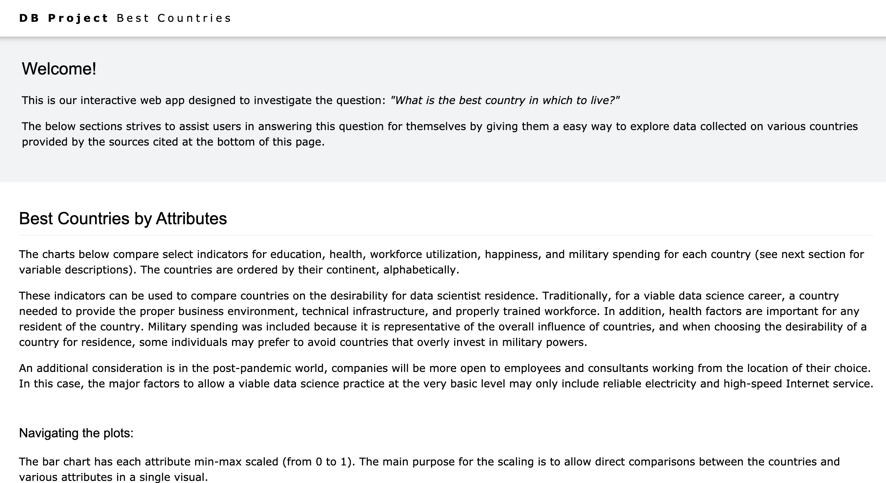
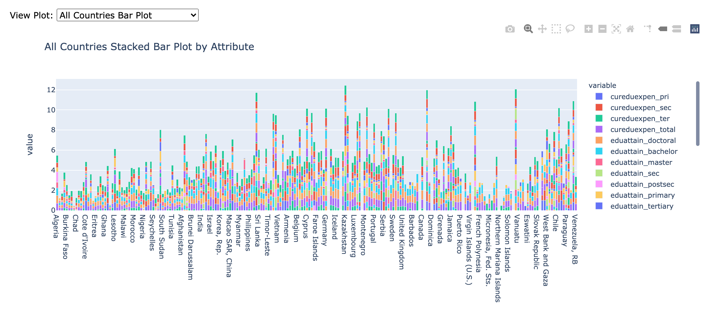
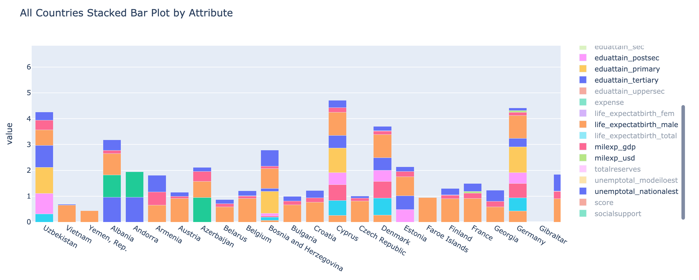
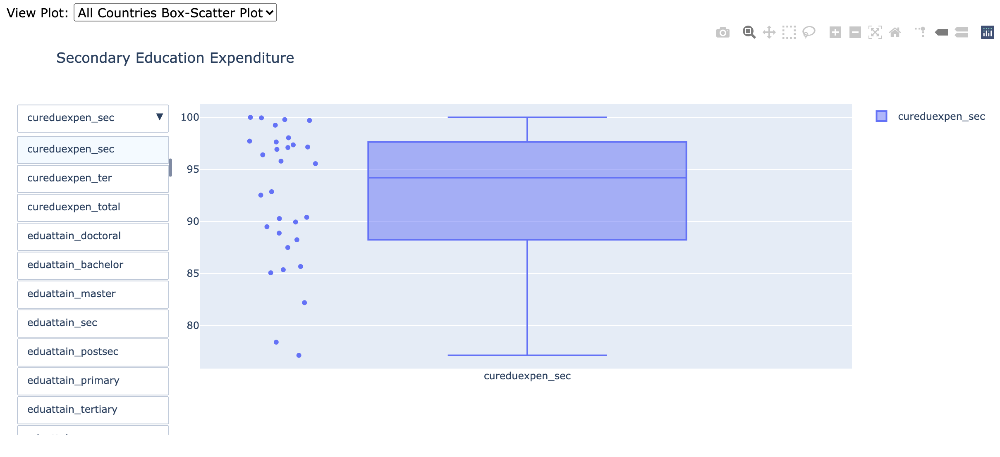
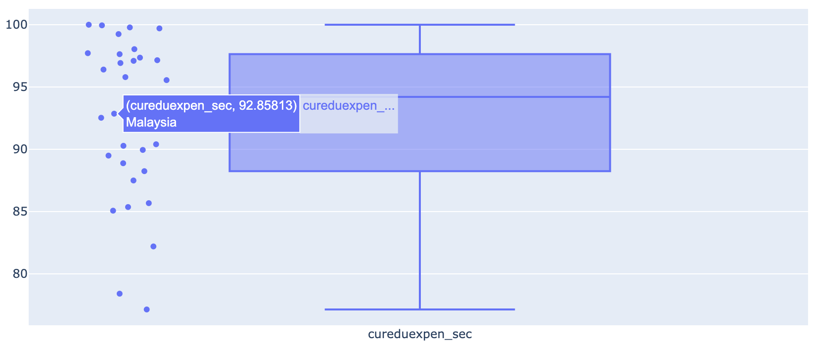
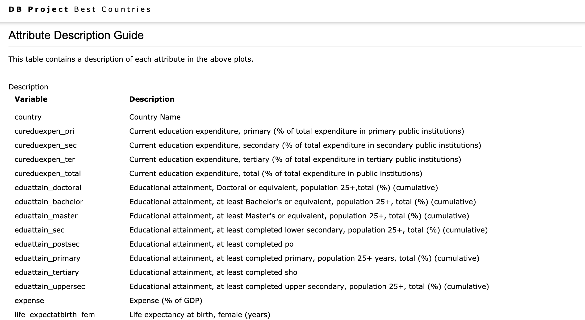
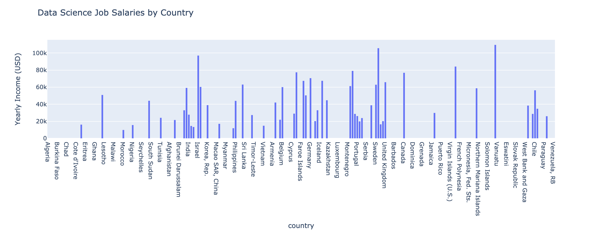
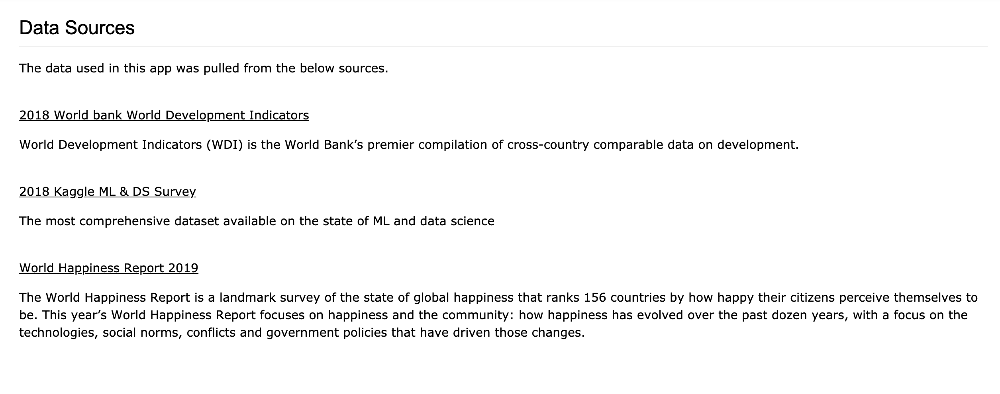

## Running the App

1. Download and unzip the code
2. Change working directory to /../../databases_project-main/BestCountries 
3. Enter "export FLASK_APP=bestcountryapp.py" in console/terminal
4. Enter "python3 -m flask run --port=5000" in console/terminal
5. Copy and paste (into your browser) the URL that appears in your console/terminal

## About the App

This is an interactive Flask web app, developed as a final project for a master's course on databases. The goal of the project was to pick a set of data and ask two big (potentially unanswerable) questions that could perhaps be answered with the data. Then, design an app that serves as a tool to allow users to answer those questions. This app is designed to be able to interface with a postgreSQL database, however, the version in this repository uses CSVs and Pandas (to allow users to run the app without access to the remote SQL database). 

Below, are some screenshots of what you will see upon running the app:

The bar chart below is a zoomed out view of all countries. Each attribute is stacked on top of the other, with min-max scaling, for better comparison.

The user can get a better look at the data, by picking an area (countries are grouped by continent) and zooming in, as shown below:

